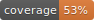

# Flutter TDD

## 用例梳理
### 首次加载
- [x] 加载中
- [x] 加载失败
- [x] 加载成功，列表为空
- [x] 加载成功，列表展示对应数据的 item
- [x] 空列表，点击可重试
- [x] 加载失败，点击可重试
- [x] 空列表可定制
- [x] 失败可定制

### 上滑加载更多
- [x] 1. 滑动到最后一个 item 的时候如果还有下一页，显示加载更多 widget
- [x] 2. 滑动到最后一个 item 的时候如果没有下一页，不显示加载更多 widget
- [x] 3. 加载结束之后，加载更多 widget 消失，且将新列表添加到列表尾部
- [x] 4. 加载结束之后，如果加载失败，回调加载失败函数
- [x] 5. 加载更多失败，点击可重试
- [x] 6. 加载更多失败，可定制

### 下拉刷新
- [x] 1. 当列表中没有数据的时候，不可以下拉刷新
- [x] 2. 当列表中有数据的时候，可以下拉刷新
- [x] 3. 下拉刷新结束，失败的时候回调失败函数
- [x] 4. 下拉刷新结束，成功的时候新列表替换旧列表
- [x] 5. 当没有提供 onRefresh 函数时，不支持下拉刷新

### 其他 
- [x] doc 补全
- [x] 重构 UI 实现 

## [《我的 Flutter TDD 心路历程》](https://github.com/GeeJoe/FlutterTDD/blob/master/%E6%88%91%E7%9A%84%20Flutter%20TDD%20%E5%BF%83%E8%B7%AF%E5%8E%86%E7%A8%8B.md)
